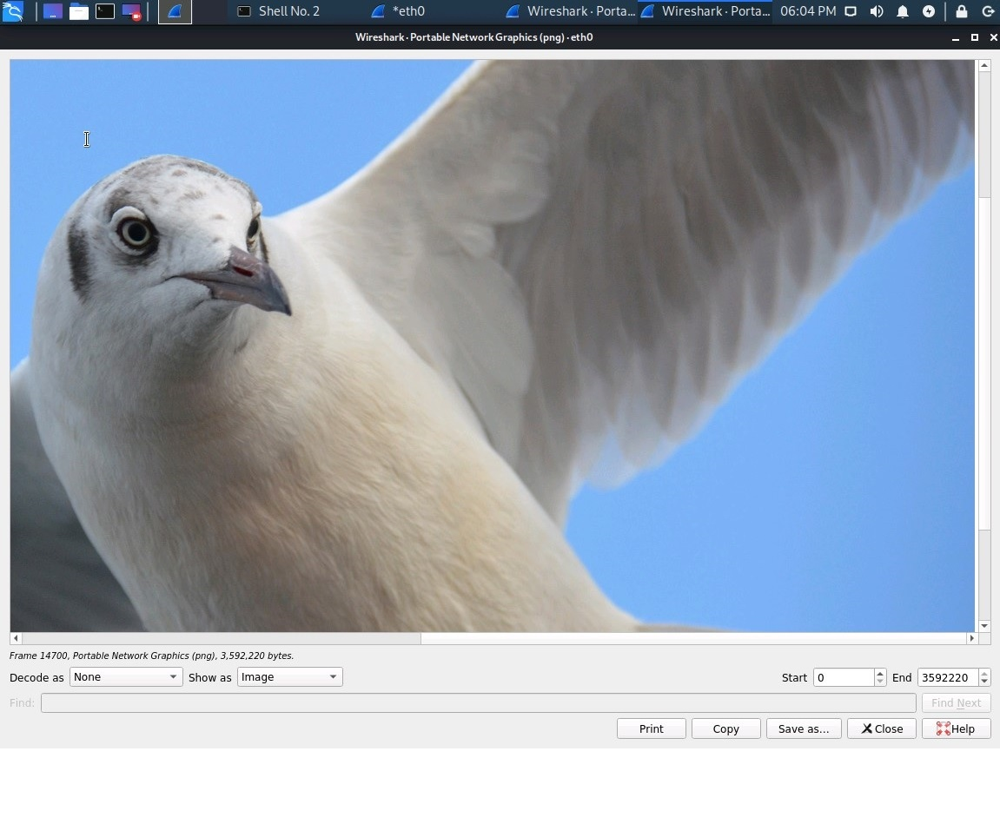

# MSU Cybersecurity Bootcamp - FINAL PROJECT

## Objective

In this project, we acted as security engineers supporting an organization's SOC infrastructure. The SOC analysts have noticed some discrepancies with alerting in the Kibana system and the manager has asked the security engineering team to investigate and confirm that newly created alerts are working.

The following alerts will be created and implemented.

- **Excessive HTTP Errors**   
  - Select the **packetbeat** indice

    ``` WHEN count() GROUPED OVER top 5 'http.response.status_code' IS ABOVE 400 FOR THE LAST 5 minutes ```

- **HTTP Request Size Monitor**   
  - Select the **packetbeat** indice

    ``` WHEN sum() of http.request.bytes OVER all documents IS ABOVE 3500 FOR THE LAST 1 minute ```

- **CPU Usage Monitor**   
  - Select the **metricbeat** indice

      ``` WHEN max() OF system.process.cpu.total.pct OVER all documents IS ABOVE 0.5 FOR THE LAST 5 minutes
  ```

If the alerts are working, we will then monitor live traffic on the wire to detect any abnormalities that aren't reflected in the alerting system. Then, we reported back your findings to the manager with appropriate analysis. 

``` 
This project was completed by Cioban Hill, Naseebah Ikram, Eric Kim, and Jacob Sharrow.
```
## Network Topology

The following machines were identified on the network:
- Name of VM 1: Kali
  - Operating System: Linux
  - Purpose: Attacking machine
  - IP Address: 192.168.1.90  
<br> 
- Name of VM 2: Elk
  - Operating System:
  - Purpose: Gather information from victim machine using Metricbeat, Filebeat and Packetbeat
  - IP Address: 192.168.1.100   
<br> 
- Name of VM 3: Target 1
  - Operating System:
  - Purpose: WordPress as vulnerable server
  - IP Address:192.168.1.110   
<br> 
- Name of VM 4: Target 2
  - Operating System:
  - Purpose: WordPress as a vulnerable server (Note: This machine is not in play for this project)
  - IP Address: 192.168.1.115  
<br> 
- Name of VM 5: Capstone
  - Operating System: Linux (Ubuntu 18.04.1 LTS)
  - Purpose: Testing system for alerts
  - IP Address:192.168.1.105   
<br> 
- Name of VM 6: Hyper V Host Manager
  - Operating System: Windows 10 
  - Purpose: Contains the vulnerable and attacking machines

# Blue Team Operations  

## Initial Scans

Here is the inital scan of the network we were given (192.168.1.1/24)


### Description of Targets

The targeted machine is found at IP address 192.168.1.110

Target 1 is an Apache web server and has SSH enabled, so ports 80 and 22 are possible ports of entry for attackers. As such, the following alerts have been implemented:

#### Monitoring the Targets

Traffic to these services should be carefully monitored. To this end, we have implemented the alerts below:

#### HTTP Request Size Monitor

HTTP Request Size Monitor is implemented as follows:

- Metric: Packetbeat : http.request.bytes
- Threshold: The sum of the requested bytes is over 3500 in 1 minute. 
  - WHEN sum() of http.request.bytes OVER all documents IS ABOVE 3500 FOR THE LAST 1 minute
- Vulnerability Mitigated: Controlling the number of HTTP request sizes through a filter, protection is enabled to detect or prevent DDOS attacks. 
Reliability: This alert doesn’t generate excessive amounts of false positives because DDOS attacks submit requests within seconds, not within minutes.  The reliability is at low.   

   

> This is **NOT** a good alert. According to the information we were given we should see 10 HTTP requests per second and HTTP requests are about 350 bytes in size. 10 requests/sec * 60 sec/min * 350 bytes/request. That calculates to 21000 bytes/min. That is 60 times larger than the threshold. This will cause alert fatigue in the SOC. 28000 bytes per minute would be a better threshold. That is ⅓ higher than normal traffic. If you look at the graphic below you will see there is an alert **EVERY MINUTE.**   
<br>
 


#### Excessive HTTP Errors   
Excessive HTTP Errors is implemented as follows:   

- Metric: Packetbeat : http.response.status_code > 400   
- Threshold: grouped http response status codes above 400 every 5 minutes   
   - WHEN count() GROUPED OVER top 5 'http.response.status_code' IS ABOVE 400 FOR THE LAST 5 minutes
- Vulnerability Mitigated: Monitoring excessive 400 errors can notify you of a malicious actor intentionally poking at your server, it can be a potential DDOS attack or a network scan.   
- Reliability: This alert has high reliability, it is possible a legitimate user is having an issue with their PC or browser, it is unlikely they would try connecting over 400 times in 5 minutes. The baseline shows that we should be getting very few 400+ errors.  

   
<br>
#### CPU Usage Monitor
- CPU Usage Monitor is implemented as follows:
- Metric: Metricbeat: system.process.cpu.total.pct
- Threshold: The maximum cpu total percentage is over .5 in 5 minutes
  - WHEN max() OF system.process.cpu.total.pct OVER all documents IS ABOVE 0.5 FOR THE LAST 5 minutes
Vulnerability Mitigated: 
- Reliability: This alert has a low reliability. There are many reasons that the CPU usage may rise to a high level and it is not always malicious.  For example, updates and patches are being applied to the machine causing a spike in CPU usage or you are having heavier than normal (but proper) traffic.
<br>   
   

# Red Team Operations

## Exposed Services

Going back to the nmap scan we can identify the following services and OS details:   


- Target 1
-- Port 22/TCP → SSH
- Port 80/TCP → HTTP
- Port 111/TCP → RPCBIND
- Port 139/TCP → Netbios-ssn
- Port 445/TCP → Netbios-ssn

## Critical Vulnerabilities:

The following vulnerabilities were identified on Target 1:

- Network Mapping and User Enumeration
  - WordPress
      - Nmap was used to see open ports
        - Found open ports and attack accordingly
- WordPress Database
Wpscan used by attacker to gain username information
Username was used by attacker to gain access to the webserver
- MySQL Database Access
  - Attacker was able to discover file containing login information for MySQL database
    - Use the login information to gain access to MySQL database
- MySQL Data Exfiltration
  - Browsing through different tables in MySQL database attackers were able to find password hashes for all users
    - Used John the Ripper to crack password for user
- Privilege Escalation
  - Attacker found that Steven had sudo privileges for python
    - Able to use privileges to escalate to root

The Red Team was able to penetrate Target 1 and retrieve the following confidential data using the following methods and commands:
- Enumerated WordPress site with wpscan to obtain username michael 
- Used SSH to get into his shell
- The command used was ***wpscan --url http://192.168.1.110/wordpress -eu***       
  


This is the website for 192.168.1.110:80 when viewed on a browser.


<br><br>
- To receive Michael’s password we used the Hydra tool
  - The command used was ***hydra -l michael -P /usr/share/wordlists/rockyou.txt -s 22 192.168.1.110 ssh*** and it was discovered that the password was **michael**.   


<br><br>
- Then the Red Team was able to SSH into Michael’s account using the command ***ssh michael@192.168.1.110*** and looked into the */var/www* files


<br><br>

- Looking around Micheal's account, the second flag was found in the directory */var/www/* directory.

<br>

- Then they moved to the html folder a grep command, ***grep -RE flag html***, was used to search for it. 

<br><br>

- They then went into the SQL database. 
  - Using ***cd /var/www/html/wordpress/*** and ***cat wp-config.php*** they were able to read teh configuration file. And they were able to see the password is *R@v3nSecurity*

<br><br>

- With that they were able to access the MySQL.


- They then looked into what databases were available. They used the following commands.
    - ***show databases;***
    - ***use wordpress;***
    - ***show tables;***
    <br>


<br>
- Then flags 3 and 4 were discovered.

<br>

- Then looking in wp-users (***select * from wp_users***)

<br>

- The hashes were copied to a local file (titled wp_hashes) and the Red Team was able to use the John the Ripper tool to crack them.
  - ***john wp_hashes.txt*** 
  - ***john -show wp_hashes.txt***
- And they were able to discover steven's password was **pink84**. 


- With that they were able to SSH into Steven's account.
  - ***ssh steven@192.168.1.110*** (password was **pink84**)


- The Red Team was then able to import a Python script to become the root user
  - ***sudo -l***
  - ***sudo python -c ‘import pty;pty.spawn(“/bin/bash”)’***


- And from there they were able to get to the root directory and some the 4th flag.
  - **cd /root/**
  - **ls**
  - **cat flag4.txt**


## Network Analysis
### Time Thieves

At least two users on the network have been wasting time on YouTube. Usually, IT wouldn't pay much mind to this behavior, but it seems these people have created their own web server on the corporate network. So far, Security knows the following about these time thieves:

- They have set up an Active Directory network.
- They are constantly watching videos on YouTube.
- Their IP addresses are somewhere in the range 10.6.12.0/24.

You must inspect your traffic capture to answer the following questions:

- What is the domain name of the users' custom site?
    - frank-n-ted-dc.frank-n-ted.com

- What is the IP address of the Domain Controller (DC) of the AD network?
    - 10.6.12.12

- What is the name of the malware downloaded to the 10.6.12.203 machine? Once you have found the file, export it to your Kali machine's desktop.
    - june11.dll


- Upload the file to VirusTotal.com. What kind of malware is this classified as?
Trojan<br>


   

## Vulnerable Windows Machines
The Security team received reports of an infected Windows host on the network. They know the following:
- Machines in the network live in the range 172.16.4.0/24.
- The domain mind-hammer.net is associated with the infected computer.
- The DC for this network lives at 172.16.4.4 and is named Mind-Hammer-DC.
- The network has standard gateway and broadcast addresses.

Inspect your traffic to answer the following questions:
- Find the following information about the infected Windows machine:
    - Host name: Rotterdamn-PC
    - IP address: 172.16.4.205
    - MAC address:00:59:07:b0:63:a4   
       


- What is the username of the Windows user whose computer is infected?
 	- Going through all the packets that used Kerberos (port 88). Eventualy we found one with a name: matthijs.devries   

   


- What are the IP addresses used in the actual infection traffic?
    - 172.16.4.205, 185.243.115.84 and 166.62.111.64. There is an unusually large amount of traffic between these IP addresses. The infection is probably between these hosts.<br> 

 

- As a bonus, retrieve the desktop background of the Windows host.   <br>

Looking for traffic from the infected host to the attackers machine there are packets going to the attacker's machine. Many of these are gathering packets for a PNG file. Examining the packet with the HTTP POST request we can see the packets that create the victim's wallpaper

   
   
